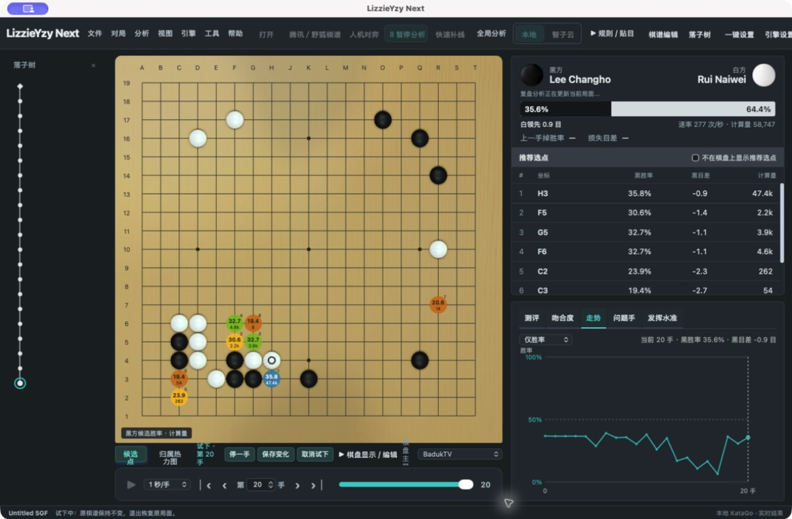
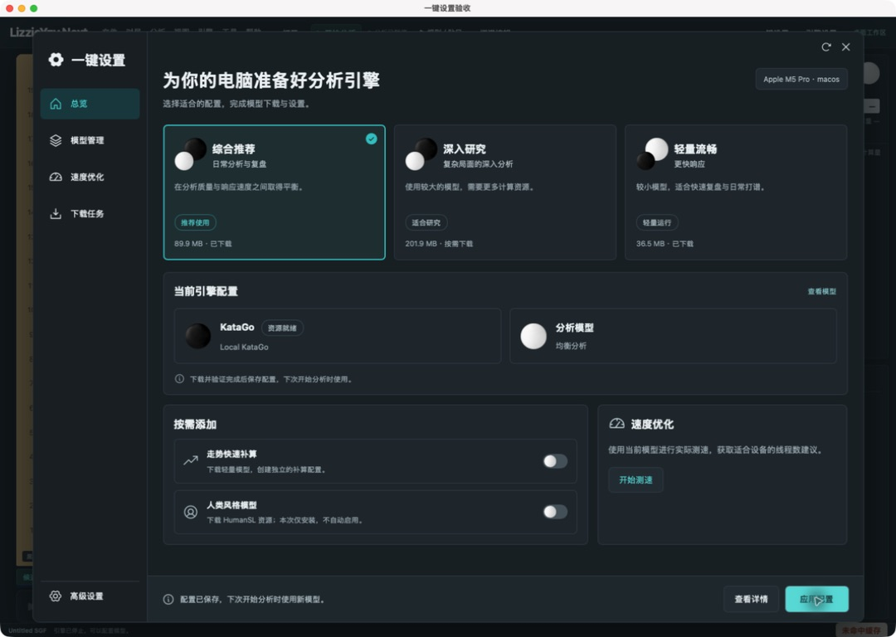

# LizzieYzy Remake

**基于 LizzieYzy 的现代桌面重制版。** 使用 Tauri 2、Rust、React 和 TypeScript 重建围棋复盘工作区，延续 Lizzie / LizzieYzy 的棋盘交互与 KataGo 分析体验。应用窗口目前仍使用 **LizzieYzy Next** 名称。

本仓库是持续开发中的重制版本，不代表原项目官方发布，也尚未实现 Java 版的全部功能。

## 界面预览

### 棋盘与复盘工作区

以正方形棋盘为主，左侧显示可关闭的落子树，右侧保留候选点和复盘模块。



*macOS 桌面应用实拍：本地 KataGo 分析与棋谱复盘工作区。*

### 一键设置

按使用场景选择配置，管理本地引擎与模型，并检测设备和资源状态。



*桌面端一键设置验收截图；具体模型与可用后端取决于设备和已安装资源。*

## 本次重制的主要功能

- **棋谱与分支**：SGF 导入、保存、编辑与回放；落子树、主分支设置、偏离主线自动试下及返回。
- **棋盘交互**：滚轮前进后退、候选点颜色、悬停变化预览、棋谱下一手标记；可单独隐藏棋盘上的推荐点，保留右侧列表。
- **引擎分析**：本地 KataGo、智子云与远程引擎配置；实时分析、全盘分析、独立本地后台 1v 补线。
- **五个复盘模块**：测评、吻合度、走势、问题手、发挥水准。走势整合胜率与目差；统计显示分析覆盖率，点击相关手数可跳转局面。
- **本地棋力测评**：迁移 Java 端 XGBoost 20TUN 模型与特征计算，在本地进行推理；模型结果用于复盘参考。
- **腾讯／野狐棋谱入口**：账号或 UID 查询、列表分页、棋谱 ID 或链接导入。外部服务真实账号下载流程仍需进一步验证。

下文保留基础工程、开发和发布说明；历史版本记录不等同于本仓库已经发布的安装包。

## Current Status

Implemented in the Next workspace:

- Tauri 2 desktop shell under `apps/desktop/src-tauri`.
- React + TypeScript + Vite frontend under `apps/desktop`.
- Rust workspace crates for app DTOs, Go rules, SGF parsing/replay/serialization, KataGo protocol normalization, analysis classification, engine management, and SQLite-backed storage/cache.
- SGF parse, replay, serialize, comments, variations, and setup stones MVP.
- Native SGF open/save through the Tauri desktop backend, with browser-preview fallbacks where possible.
- KataGo one-position analysis and full-game batch analysis through analysis JSONL.
- Analysis progress events, cancellation, candidate moves, ownership, policy, and winrate/progress overlays.
- Engine path/model/config pickers, asset checks, and multiple engine profiles persisted in app data.
- Bundled/runtime asset layout status display in Engine setup, while preserving local KataGo engine/model/config configuration.
- SQLite analysis cache with cache key computation, lookup, save, and delete commands.
- Scaffold validation, Rust tests, and frontend build checks wired for local and CI use.
- Release preflight validation for Tauri metadata and the safe dry-run workflow.
- Multi-platform GitHub Release workflow for macOS, Windows, and Linux CI-built assets.
- Bilingual English/Chinese release notes for `v0.1.0`.

Not yet claimed as complete in the Next workspace:

- Full legacy Java/Swing feature parity.
- Fox/Yike online game providers as live external-network integrations.
- readboard live sidecar integration in a real target environment.
- Production signing/notarization for macOS and Windows unless maintainer secrets are configured.
- End-to-end clean-machine installer smoke coverage across all target platforms.
- Bundling large KataGo models, installed-app bundled engine launch validation, and release artifact inclusion for bundled runtime assets.
- Complete migration of every legacy setting, layout preference, and analysis workflow.

Provider and readboard work in this batch should be treated as offline contract/domain-command coverage until the owning implementation has live environment evidence. Do not describe live provider login, external network capture, or readboard sidecar operation as shipped from this repository alone.

## Technology Stack

- Desktop runtime: Tauri 2.
- Backend: Rust workspace, Tauri commands, SQLite via `rusqlite`.
- Frontend: React, TypeScript, Vite, `@tauri-apps/api`.
- Core domains: SGF, Go rules, KataGo analysis JSONL, engine profiles, analysis cache.
- Validation: `scripts/validate_scaffold.py`, Rust unit tests, frontend build, and smoke checks.

## Repository Map

- `apps/desktop`: Next React desktop UI.
- `apps/desktop/src-tauri`: Tauri 2 command gateway and native desktop integration.
- `crates/app-model`: Shared DTOs used across Rust and TypeScript boundaries.
- `crates/go-core`: Board state and Go rule logic.
- `crates/sgf`: SGF parsing, replay, and serialization.
- `crates/katago-protocol`: KataGo analysis query/response models.
- `crates/analysis-core`: Candidate/problem classification helpers.
- `crates/engine-manager`: Engine command specs, asset checks, process execution, and cancellation.
- `crates/storage`: SQLite storage/cache schema helpers.
- `docs/ARCHITECTURE_NEXT.md`: Current Next architecture and module boundaries.
- `docs/MIGRATION_PLAN.md`: Completed and pending migration work.
- `docs/DEVELOPMENT.md`: Local development and smoke validation commands.
- `docs/RELEASE_CHECKLIST.md`: Release-readiness checklist and manual acceptance flow.

## Development Commands

Run scaffold validation from the repository root:

```bash
python3 scripts/validate_scaffold.py --verbose
```

Run release asset preflight from the repository root:

```bash
python3 scripts/validate_release_assets.py --verbose
python3 scripts/validate_release_workflow.py --verbose
```

Run the Rust checks:

```bash
cargo fmt --all --check
cargo clippy --workspace --all-targets -- -D warnings
cargo test --workspace
```

Run the frontend build:

```bash
cd apps/desktop
npm ci
npm run build
```

Run the Next app in development:

```bash
cd apps/desktop
npm run tauri:dev
```

For a browser-only preview without native Tauri commands:

```bash
cd apps/desktop
npm run dev
```

The browser preview can exercise UI fallback paths, local SGF parsing fallback, fake review frames, and browser-local cache. Real KataGo execution, native file open/save, runtime asset inspection, local asset inspection, and app-data profile persistence require the Tauri desktop runtime.

## Local Smoke Flow

Use `docs/DEVELOPMENT.md` for the full checklist. The short acceptance path is:

1. Run `python3 scripts/validate_scaffold.py --verbose`.
2. Start `npm run tauri:dev` in `apps/desktop`.
3. Open an SGF file or paste one from `tests/golden`.
4. Configure a KataGo engine profile with engine, model, config, optional working directory, and max visits.
5. Review bundled/runtime asset status, then run `Check assets` and confirm required local assets are present.
6. Run one-position KataGo analysis.
7. Run full-game analysis, observe progress, and cancel a second run to verify cancellation.
8. Reopen or reparse the same SGF and confirm analysis cache hit status.
9. Save or Save As the SGF and reopen it to confirm round-trip behavior.

## CI Status

CI should be read as scaffold and regression coverage for the Next workspace, not as proof of full legacy parity. The important gates are:

- scaffold validation,
- release asset preflight and production release workflow contract validation,
- frontend dependency install and build,
- Rust formatting,
- Rust clippy,
- Rust tests.

Provider contract tests and readboard domain tests are accepted through the Rust workspace test gate when those modules land; the handoff should name the exact package or test filter and must not count a zero-test filter as evidence. Release dry-run acceptance is `.github/workflows/release-dry-run.yml` plus `python3 scripts/validate_release_assets.py --verbose`; the workflow uploads diagnostic artifacts and must not create a GitHub release.

Passing CI means the current Tauri/Rust/TypeScript baseline is structurally healthy. It does not mean live Fox/Yike/readboard integrations, bundled large KataGo model distribution, installed-app bundled engine launch, platform signing, notarization, release inclusion, or clean-machine installer smoke checks have completed.

## Releases

`v0.1.0` is the first public Tauri release candidate for this repository. Release notes are bilingual:

- [Release notes v0.1.0](.github/RELEASE_NOTES_v0.1.0.md)
- [Changelog](CHANGELOG.md)

The production release workflow is `.github/workflows/release.yml`. It runs on `v*` tags, builds macOS, Windows, and Linux Tauri bundles, collects assets, writes SHA-256 checksum files, and publishes a GitHub Release. Assets generated without signing or notarization secrets are clearly marked as unsigned release-candidate artifacts.

## Documentation

- [Next architecture](docs/ARCHITECTURE_NEXT.md)
- [Migration plan](docs/MIGRATION_PLAN.md)
- [Development guide](docs/DEVELOPMENT.md)
- [Release checklist](docs/RELEASE_CHECKLIST.md)
- [Troubleshooting](docs/TROUBLESHOOTING.md)

## 致谢与参考来源

感谢以下项目的作者和维护者。本项目沿用或参考其工作，并保留相关来源说明；各上游代码、模型与资源的权利及许可归原项目所有。

| 项目 | 参考与复用内容 |
| --- | --- |
| [yzyray/lizzieyzy](https://github.com/yzyray/lizzieyzy) | 重制所基于的原始 LizzieYzy 项目与围棋复盘交互。 |
| [wimi321/lizzieyzy-next](https://github.com/wimi321/lizzieyzy-next) | Java 维护版本；棋力评估模型、特征计算、吻合度与发挥水准统计的迁移参考。 |
| [wimi321/lizzieyzy-next-tauri](https://github.com/wimi321/lizzieyzy-next-tauri) | Tauri / Rust / TypeScript 桌面重构工程基础。 |
| [lightvector/KataGo](https://github.com/lightvector/KataGo) | 围棋分析引擎、分析协议与神经网络模型生态。 |
| [yzyray/FoxRequest](https://github.com/yzyray/FoxRequest) | 野狐棋谱请求相关参考。 |
| [FuckUbuntu/Lizzieyzy-Helper](https://github.com/FuckUbuntu/Lizzieyzy-Helper) | 历史野狐接入辅助实现参考。 |

